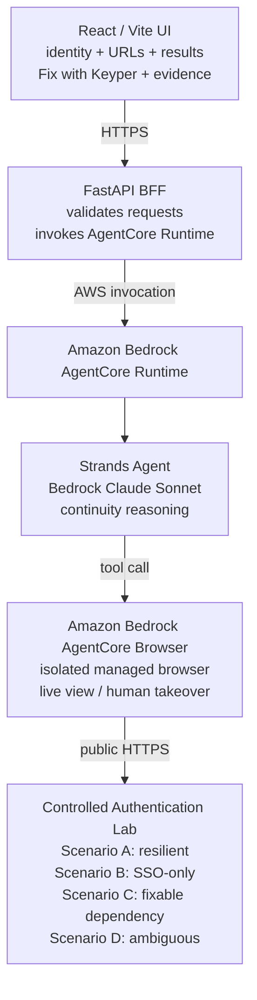

# Keyper — architecture

**Critical design rule:** the lab contains scenarios; the agent contains no
scenario-specific knowledge. The same agent prompt and generic browser
capability analyzes every scenario (see `agent/prompts.py` — if you ever see
an `if service_url == ...` branch anywhere in this repo, that's a bug).

For a submission-ready PNG: paste the mermaid block above into
https://mermaid.live and export, or use the "Export architecture image"
step in RUNBOOK.md once you have a rendering tool available locally.

## Where each requirement lives

| Requirement | File |
|---|---|
| Strands agent | `agent/agent.py` |
| AgentCore Browser tool | `agent/agent.py` (`AgentCoreBrowser`) |
| AgentCore Runtime entrypoint | `agent/runtime_entrypoint.py` |
| Site-agnostic prompt | `agent/prompts.py` |
| Evidence + human-checkpoint tools | `agent/tools.py` |
| Structured result schema | `agent/schemas.py` |
| FastAPI BFF | `api/main.py` |
| React UI | `web/src/` |
| Controlled auth lab (4 scenarios) | `auth-lab/app.py` |
| Deploy scripts | `scripts/` |
| Tests | `tests/` |
